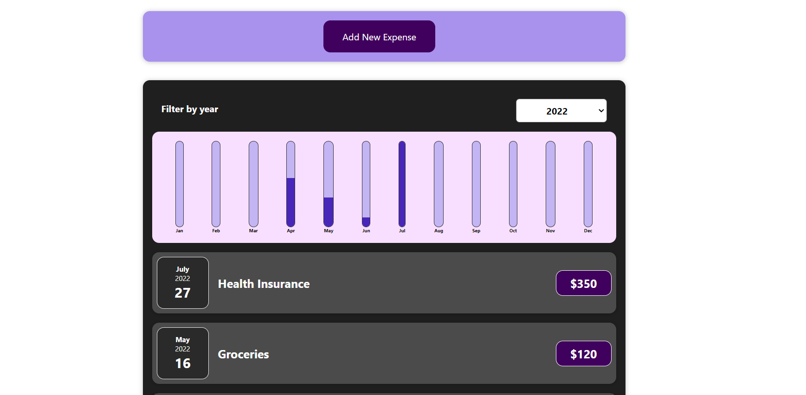
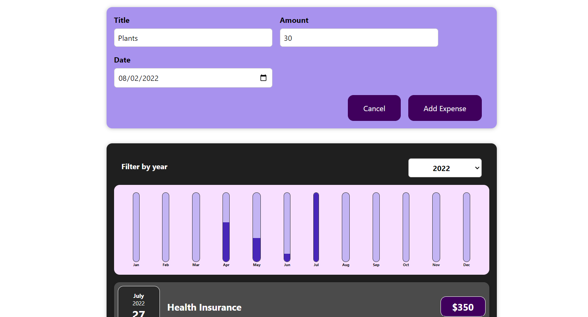
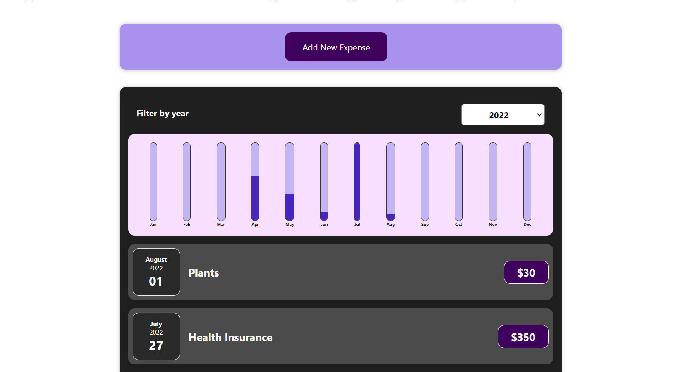

  <h2 align="center">Expense Tracker</h2>

<!-- ABOUT THE PROJECT -->
## About The Project

A web application built with React.js that helps you keep track of your expenses. 
This expense tracker provides a simple and intuitive interface for managing your financial transactions and monitoring your spending habits.

### Screenshots

